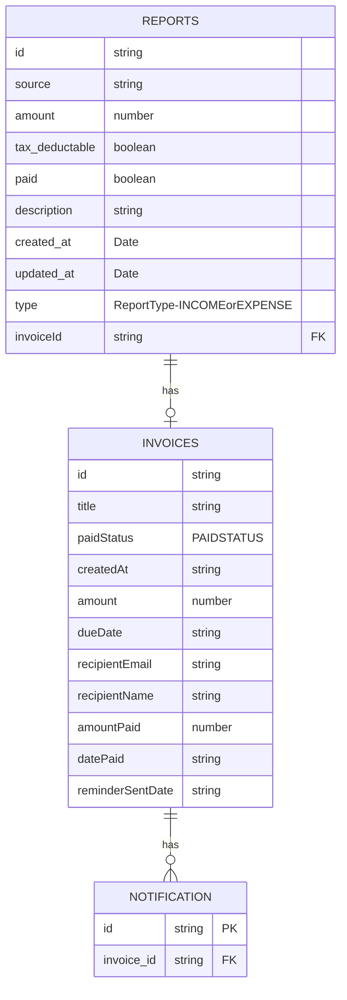
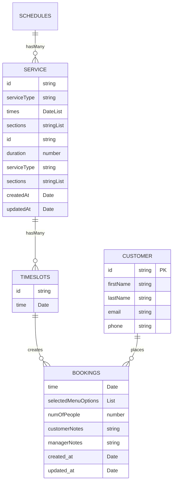
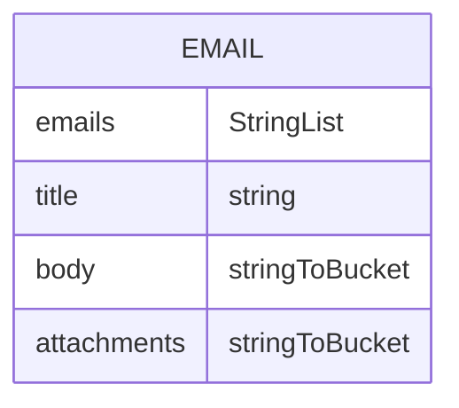
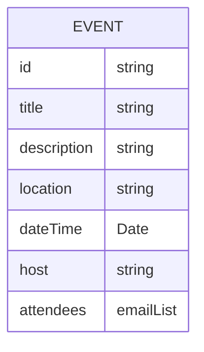

# Serverless experimentation
Personal application for automating my invoices.
React, NextJS. Typescript, Serverless.

Allows you to create an invoice and email it out and keep track and remind of overdue invoices.


##### Bonus booking site for my portfolio.

###### Create an event, have users sign up to it.

# Serverless - AWS Node.js Typescript

This project has been generated using the `aws-nodejs-typescript` template from the [Serverless framework](https://www.serverless.com/).

For detailed instructions, please refer to the [documentation](https://www.serverless.com/framework/docs/providers/aws/).

## Installation/deployment instructions

Depending on your preferred package manager, follow the instructions below to deploy your project.

> **Requirements**: NodeJS `lts/fermium (v.14.15.0)`. If you're using [nvm](https://github.com/nvm-sh/nvm), run `nvm use` to ensure you're using the same Node version in local and in your lambda's runtime.

### Using NPM

- Run `npm i` to install the project dependencies
- Run `npx sls deploy` to deploy this stack to AWS

### Using Yarn

- Run `yarn` to install the project dependencies
- Run `yarn sls deploy` to deploy this stack to AWS

## Test your service

This template contains a single lambda function triggered by an HTTP request made on the provisioned API Gateway REST API `/hello` route with `POST` method. The request body must be provided as `application/json`. The body structure is tested by API Gateway against `src/functions/hello/schema.ts` JSON-Schema definition: it must contain the `name` property.

- requesting any other path than `/hello` with any other method than `POST` will result in API Gateway returning a `403` HTTP error code
- sending a `POST` request to `/hello` with a payload **not** containing a string property named `name` will result in API Gateway returning a `400` HTTP error code
- sending a `POST` request to `/hello` with a payload containing a string property named `name` will result in API Gateway returning a `200` HTTP status code with a message saluting the provided name and the detailed event processed by the lambda

> :warning: As is, this template, once deployed, opens a **public** endpoint within your AWS account resources. Anybody with the URL can actively execute the API Gateway endpoint and the corresponding lambda. You should protect this endpoint with the authentication method of your choice.

### Locally

In order to test the hello function locally, run the following command:

- `npx sls invoke local -f hello --path src/functions/hello/mock.json` if you're using NPM
- `yarn sls invoke local -f hello --path src/functions/hello/mock.json` if you're using Yarn

Check the [sls invoke local command documentation](https://www.serverless.com/framework/docs/providers/aws/cli-reference/invoke-local/) for more information.

### Remotely

Copy and replace your `url` - found in Serverless `deploy` command output - and `name` parameter in the following `curl` command in your terminal or in Postman to test your newly deployed application.

```
curl --location --request POST 'https://myApiEndpoint/dev/hello' \
--header 'Content-Type: application/json' \
--data-raw '{
    "name": "Frederic"
}'
```

## Template features

### Project structure

The project code base is mainly located within the `src` folder. This folder is divided in:

- `functions` - containing code base and configuration for your lambda functions
- `libs` - containing shared code base between your lambdas

```
.
├── src
│   ├── functions               # Lambda configuration and source code folder
│   │   ├── hello
│   │   │   ├── handler.ts      # `Hello` lambda source code
│   │   │   ├── index.ts        # `Hello` lambda Serverless configuration
│   │   │   ├── mock.json       # `Hello` lambda input parameter, if any, for local invocation
│   │   │   └── schema.ts       # `Hello` lambda input event JSON-Schema
│   │   │
│   │   └── index.ts            # Import/export of all lambda configurations
│   │
│   └── libs                    # Lambda shared code
│       └── apiGateway.ts       # API Gateway specific helpers
│       └── handlerResolver.ts  # Sharable library for resolving lambda handlers
│       └── lambda.ts           # Lambda middleware
│
├── package.json
├── serverless.ts               # Serverless service file
├── tsconfig.json               # Typescript compiler configuration
├── tsconfig.paths.json         # Typescript paths
└── webpack.config.js           # Webpack configuration
```

### 3rd party libraries

- [json-schema-to-ts](https://github.com/ThomasAribart/json-schema-to-ts) - uses JSON-Schema definitions used by API Gateway for HTTP request validation to statically generate TypeScript types in your lambda's handler code base
- [middy](https://github.com/middyjs/middy) - middleware engine for Node.Js lambda. This template uses [http-json-body-parser](https://github.com/middyjs/middy/tree/master/packages/http-json-body-parser) to convert API Gateway `event.body` property, originally passed as a stringified JSON, to its corresponding parsed object
- [@serverless/typescript](https://github.com/serverless/typescript) - provides up-to-date TypeScript definitions for your `serverless.ts` service file

### Advanced usage

Any tsconfig.json can be used, but if you do, set the environment variable `TS_NODE_CONFIG` for building the application, eg `TS_NODE_CONFIG=./tsconfig.app.json npx serverless webpack`


# Personal notes

To deploy: 
sls deploy --verbose
sls deploy -f FUNCTION_NAME

show logs
sls logs -f remindInvoice -t
sls invoke -f remindInvoice -l

watch logs
sls logs -f sendMail -t

offline: serverless offline start
TODOS
get next two weeks off bookings by copying the getOverdueInvoices


Goal: Service to send an email confirming, reminding of booking, invoicing booking for dr appointments

sls -c serverless.ts deploy --verbose



// other ideas:

// Restaurant / Medical booking


// Email service only
no auth or machine to machine auth, just email only that can be used by another server



// Event planner.
Create events, share via id, get email notifications, small nice portfolio app, lets business send out emails or text if you add a user table.

Auth0:
You will need to generate an jwt using auth0, either a machine to machine application or a logged in user.

https://gist.github.com/arielweinberger/21d3b72bb4f345a410abb7e98a17cc96

```
curl --location --request POST 'https://YOUR_AUTH0_DOMAIN/oauth/token' \
--header 'Content-Type: application/x-www-form-urlencoded' \
--data-urlencode 'client_id=YOUR_AUTH0_CLIENT_ID' \
--data-urlencode 'username=YOUR_USERNAME' \
--data-urlencode 'password=YOUR_PASSWORD' \
--data-urlencode 'grant_type=password' \
--data-urlencode 'scope=openid'
--data-urlencode 'audience=YOUR_AUDIENCE_IDENTIFIER'
```
The username and password is for a user, but your application(the client id) must have username password auth enabled, the audience is from an api

Need to let anyone create and invoice, only see the invoices you created, can only pay the invoices assigned to you (recipient) or you created.


# Commands
sls info


# Operation.
Create an invoice
Which sends an email
sls invoke -f remindInvoice -l
to go through and check any overdue invoices (UNPAID and dueDate < now and hasn't been reminded in a week)
List through invoices.


TODO
1. filter by date

0. Email last sent updated when paying invoice? Done.
1. Get name and email showing in front end
2. get FE hosted. Done
3. Edit invoice
4. Resend Invoice
5. Fix reminder service
6. Filter invoices by email. - use new index or add a filter
7. Make sure when you are logged in you only see your invoices, admin sees the invoices they created, user sees ones assigned to them.
8. Get S3 upload working, upload pdf invoice and link to it.
9. Better rework the login system. Profile and preferences. When to send email/default template for email you enter. Enter an email and a due date and it fills out rest based of the template.
10. github action for sls deploy for all 3 services.
11. Tick box to create the next invoicing on paying
12. Serverless offline
13. unit tests
14. cypress
15. Monorepo? 
16. Context for something to show recruiters how cool I am
17. Infinite scroll or something
18. Fix bug that happens when you create multiple in a row fast on the FE.
19. AWS diagrams using mermaid, SQS and SES, auth setup etc.
20. get rid of next and serverless and use react and s3

11/12/22
Bug list
Need to display an error message when login expires.

19/2/2023 new tickets
Show who is logged in
payment list


5/9/23
only show and allow paying of invoices by createdBy.


## Serverless offline
`npm i -g dynamodb-admin`

`DYNAMO_ENDPOINT=http://localhost:8000 dynamodb-admin`
